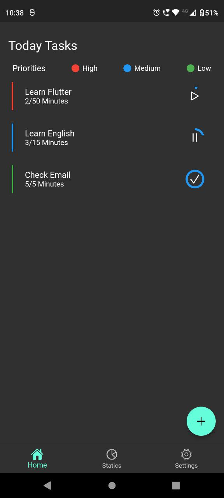
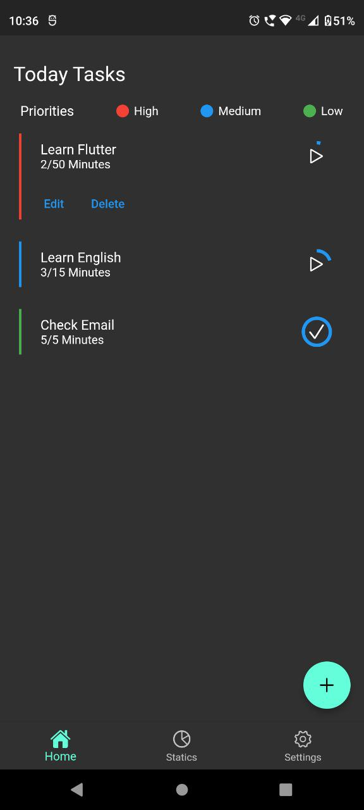
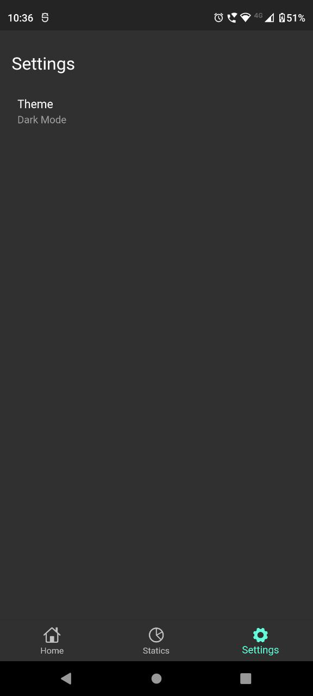
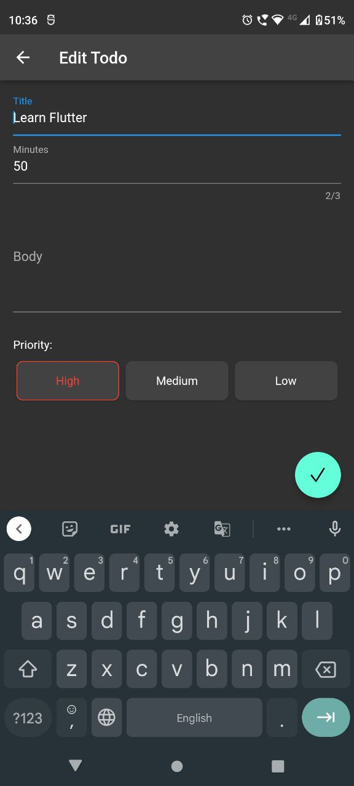
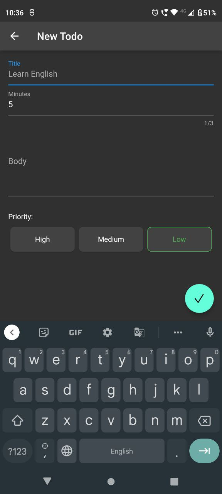
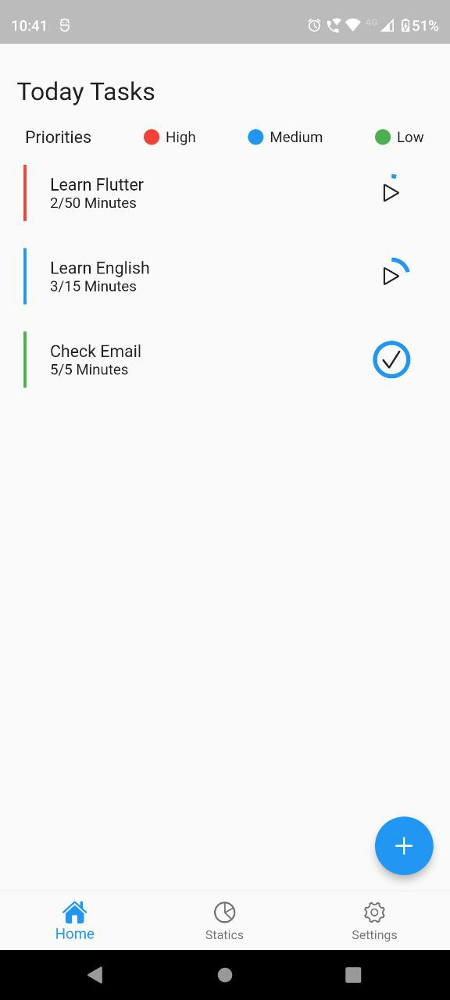
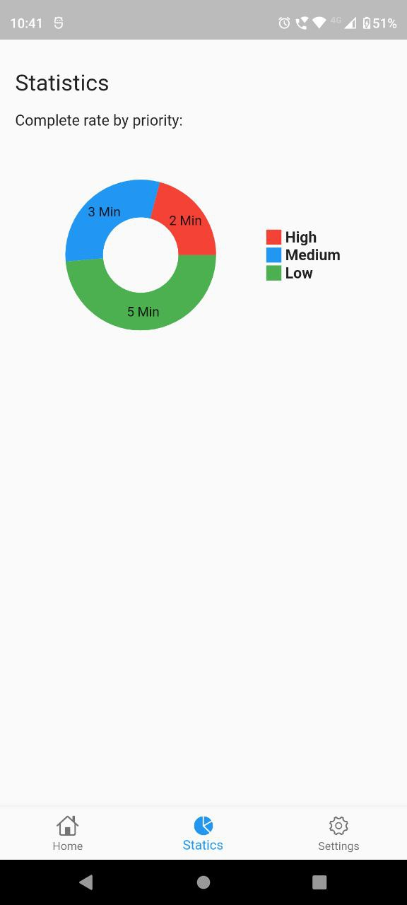
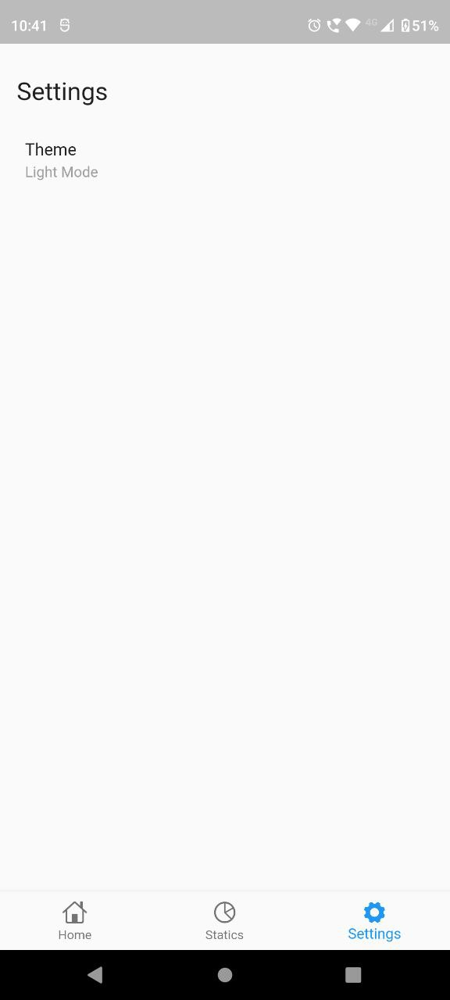
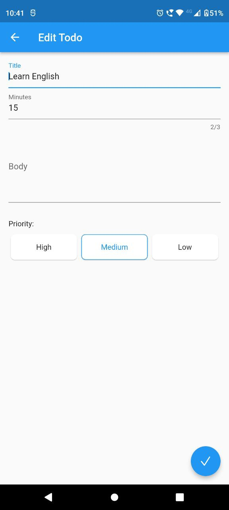
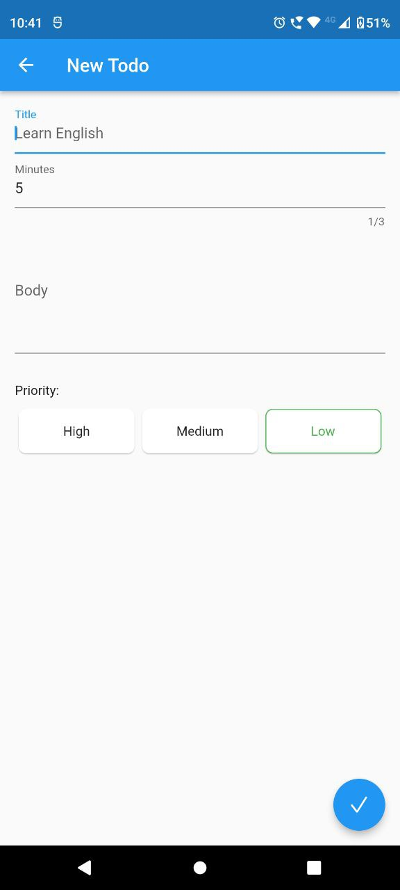

# Daily Task Manager

This project is a simple todo/task app and my first flutter app.

In this app,
1. You can create task with title, body, minutes, priority etc.
2. Progress are reset for every day, so you can track your activity.
3. Statistic page currently showing complete rate by priority only.
4. Toggle dark/light theme.
5. Show notification when complete task.

### Screenshots:

##### Dark Theme
<table>
  <tr>
    <td>Home Page</td>
     <td>Expand Task</td>
     <td>Statistic Page</td>
  </tr>
  <tr>
    <td></td>
    <td></td>
    <td></td>
  </tr>
  <tr>
    <td>Settings Page</td>
     <td>Edit Todo</td>
     <td>Create Todo</td>
  </tr>
  <tr>
    <td></td>
    <td></td>
    <td></td>
  </tr>
 </table>

##### Light Theme
<table>
  <tr>
    <td>Home Page</td>
     <td>Statistic Page</td>
     <td>Settings Page</td>
  </tr>
  <tr>
    <td></td>
    <td></td>
    <td></td>
  </tr>
  <tr>
    <td>Edit Todo</td>
     <td>Create Todo</td>
  </tr>
  <tr>
    <td></td>
    <td></td>
  </tr>
 </table>

 # Getting started
 1. Clone the project